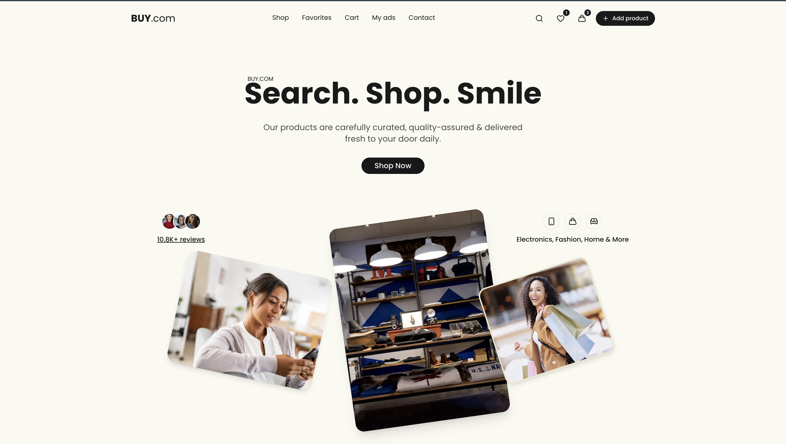
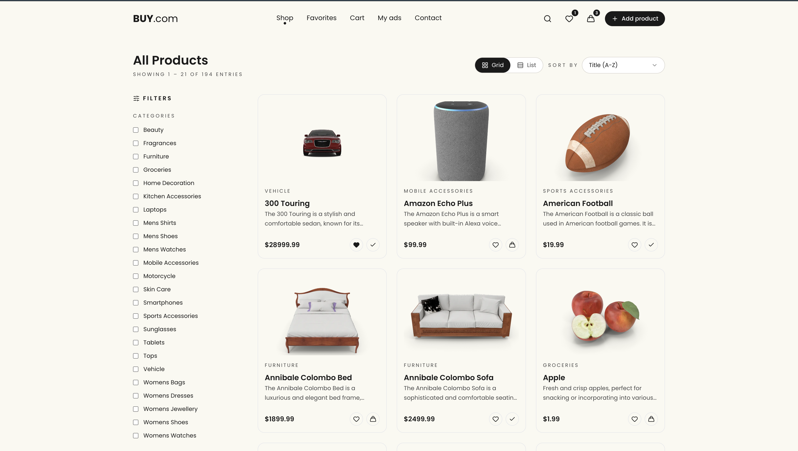
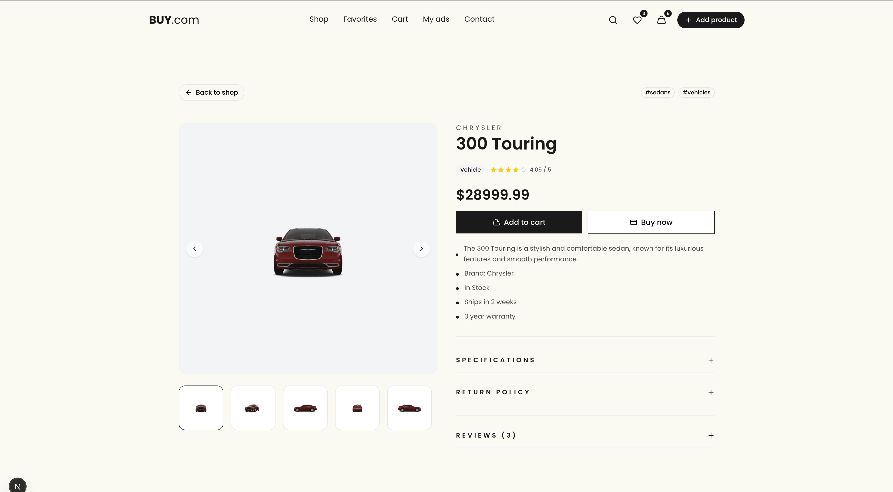
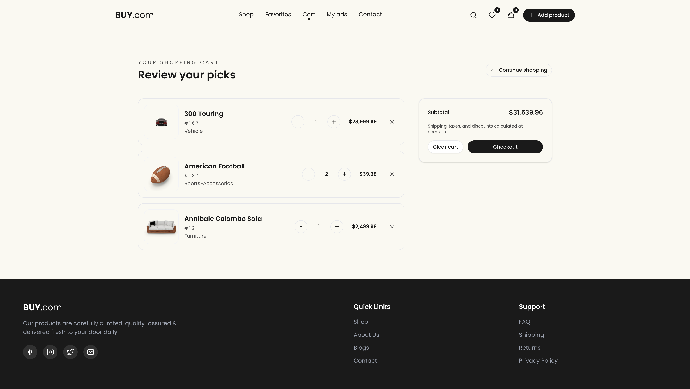
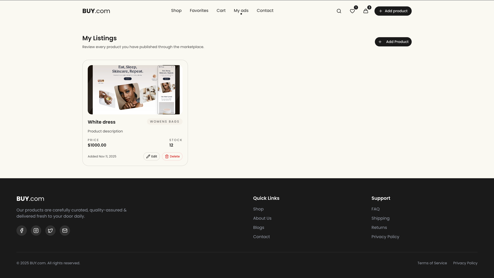

## Buy.com — Modern E-commerce Experience

Buy.com is a fully featured e-commerce experience built with Next.js 14 and the App Router. It blends a high-end landing page, data-driven shopping flows, and customer tooling (favorites, cart, product detail, contact, etc.) with admin-style conveniences like product creation/editing. The UI is animated with Framer Motion and styled with Tailwind + shadcn/ui.

---

## ✨ Highlights

- **Animated Landing Page** – Hero skewed imagery, scroll-triggered sections, framer-motion enhanced reviews/categories, and a “Popular Products” showcase.
- **Global Navigation & Footer** – Persistent header/footer via `app/layout.tsx`, animated nav hover states, active route indicators, responsive search, and live cart/favorite counters.
- **Search Experience** – Expanding search input with debounce-backed API results, loading states, and quick navigation to detail pages.
- **Popular Products** – React Query powered section with skeleton placeholders, “View All” linking into the shop, and shadcn components for consistent styling.
- **Shop / Catalog** – Grid/list toggle, server-driven filtering (categories, availability), shadcn select sorting, pagination (21 items/page), and loader/empty/error states.
- **Product Detail** – Amazon-inspired layout with gallery carousel, rating, bullet lists, add-to-cart actions, and toast feedback.
- **Favorites** – Redux Toolkit slice persisted to localStorage, with dedicated page for management, and hot-toast notifications.
- **Cart** – Responsive summary layout, quantity controls, empty state messaging, subtotal computation, and “favorites you might add” suggestions.
- **My Listings ("My Ads")** – Product creation/editing workflow using DummyJSON `/products/add`, React Query, and local IndexedDB storage to persist custom images, with edit/delete operations and responsive cards.
- **Contact Page** – Animated two-column layout (info + form) aligned with brand styling.
- **Tech Enhancements** – `usePopularProducts`, `useProductSearch`, global React Query + Redux providers, axios API abstraction, and reusable UI primitives (Badge, Button, Card, Skeleton, Select).

---

## 🧠 Tech Stack

- **Framework**: Next.js 14 (App Router, React Server Components)
- **State & Data**: Redux Toolkit, React Query, Axios, IndexedDB
- **UI/Styling**: Tailwind CSS, shadcn/ui, Framer Motion, Lucide icons, Google Fonts (Poppins)
- **Tooling**: TypeScript, ESLint, Vercel-ready configuration
- **APIs**: [DummyJSON](https://dummyjson.com) fake store API (products, categories, search)

### Environment Variable

```bash
NEXT_PUBLIC_API_BASE_URL=https://dummyjson.com/
```

---

## 🚀 Getting Started

Install dependencies:

```bash
npm install
```

Run the dev server:

```bash
npm run dev
```

Visit http://localhost:3000 to explore the site. Editing files within `app/` will hot-reload changes automatically.

To create a production build:

```bash
npm run build
npm run start
```

---

## Screenshots

All captures live under `public/screenshots/`.

| Landing Page                               | Shop (Grid)                          | Product Detail                                           | Cart                                 | My Listings                                   |
| ------------------------------------------ | ------------------------------------ | -------------------------------------------------------- | ------------------------------------ | --------------------------------------------- |
|  |  |  |  |  |


---

## 📚 Additional Notes

- Product creation/editing stores local images in IndexedDB (`lib/db/myListings.ts`) so DummyJSON only receives metadata—handy for prototyping admin-like experiences.
- The mobile layout is fully responsive: headers collapse into a motion-animated drawer, filters stack, and the cart summary becomes sticky on larger breakpoints.
- Redux Toolkit slices (`lib/store`) manage favorites and cart, persisting to localStorage for a seamless return experience.

---

## 📖 Learn More

- [Next.js Documentation](https://nextjs.org/docs) – Latest features and API guides.
- [shadcn/ui](https://ui.shadcn.com/) – Component usage and theming tips.
- [Framer Motion](https://www.framer.com/motion/) – Declarative animation sequences.
- [DummyJSON API Docs](https://dummyjson.com/docs/products) – Endpoints used throughout the app.

---

## 📦 Deployment

you can find the live demo at [buy.com](https://buycom-psi.vercel.app/)

Enjoy exploring and extending Buy.com! 💼🛒
